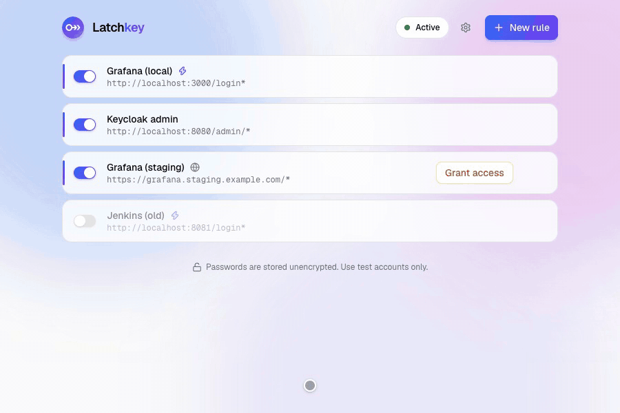
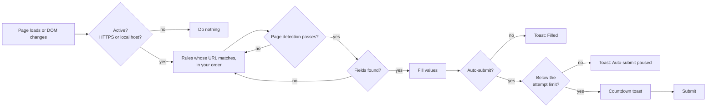

<!-- prettier-ignore -->
<div align="center">


# Latchkey

**Log in to your dev apps without typing. Rule-based login autofill for Chrome and Firefox.**


[](LICENSE)

[Features](#features) • [Install](#install) • [Quick start](#quick-start) • [Rules](#rules) • [How it works](#how-it-works) • [Development](#development)



</div>

When you work on a web app, you log in to it hundreds of times: after every backend restart, after clearing storage, in a fresh profile, on a feature branch with a new database. Password managers are a poor fit for this. They don't submit the form, they mix up `localhost:3000` and `localhost:8080`, and they ask before every fill.

Latchkey does one thing: **when a page matches one of your rules, it fills in the credentials and, if you want, submits the form.** You decide exactly when that happens: by URL, port, path, page title or an element on the page. No accounts, no cloud, no tracking.

> [!WARNING]
> Credentials are stored **in plain text** in the extension's local storage and in exported files. Latchkey is meant for development, test and staging accounts. Don't store personal or production passwords.

## Features

- **Rules you control.** Each rule has a URL pattern, optional page detection, credentials and a submit policy. The first enabled rule that matches wins, and you set the order.
- **Ports, ranges and wildcards.** `localhost:3000-3999`, `localhost:3*`, `*.example.com`: one pattern covers all your dev servers.
- **Page detection.** Tell apart apps that share a host with *title contains* and *element exists* conditions, combined with AND or OR.
- **Works with SPAs.** Waits for late-rendered forms and client-side navigation, and sets values so React, Vue, Angular and Formik register them.
- **Safe auto-submit.** A countdown toast gives you time to press **Esc**. If the stored password is wrong, loop protection stops after *N* attempts, so you never hammer a login endpoint.
- **Minimal access.** `localhost` and `127.0.0.1` work out of the box. Any other site needs an explicit, per-origin permission that you grant when you save the rule.
- **Popup diagnostics.** See which rule matched the current page, why another one didn't, and fill on demand.
- **Import and export.** Share a rule set with your team as a JSON file.

## Install

Latchkey is not in the extension stores yet. Build it once, then load it unpacked. You need [Node.js](https://nodejs.org) 20.19 or newer.

```bash
git clone https://github.com/dkrizan/latchkey.git
cd latchkey
npm install
npm run build   # creates dist/chrome, dist/firefox and matching .zip files
```

### Chrome, Edge, Brave, Arc

1. Open `chrome://extensions` and turn on **Developer mode**.
2. Click **Load unpacked** and select the `dist/chrome` folder.
3. Pin Latchkey to the toolbar. The rules page opens automatically.

### Firefox

1. Open `about:debugging#/runtime/this-firefox`.
2. Click **Load Temporary Add-on…** and select `dist/firefox/manifest.json`.
3. If the rules page says *No access to localhost*, click **Grant**.

> [!NOTE]
> Firefox removes temporary add-ons when it restarts. To keep Latchkey installed, sign the zip as an unlisted add-on on [addons.mozilla.org](https://addons.mozilla.org/developers/) (free and automated), or use Firefox Developer Edition with `xpinstall.signatures.required` set to `false`.

## Quick start

1. Open your app's login page and click the Latchkey icon.
2. Click **Add rule for this site**. The rule editor opens with the URL filled in.
3. Enter the **username** and **password**, and turn on **Submit automatically** if you want Latchkey to log you in.
4. Click **Save** and reload the page.

> [!TIP]
> Several apps on `localhost`? Add a **Title contains** condition with your app's name, so the rule only fires on the right login page.

## Rules

| Field | Description |
|---|---|
| **Name** | Shown in the rule list, the popup and the toast. |
| **URL** | Where the rule applies. See [URL patterns](#url-patterns). Required. |
| **Username**, **Password** | Values to fill in. At least one is required. |
| **Submit automatically** | Submits the form after the delay set in *Settings*. |
| **Title contains** | Case-insensitive text (`grafana`), or a regular expression such as `/^Grafana/i`. Optional. |
| **Element exists** | Any CSS selector, such as `[data-app="admin"]`. Optional. |
| **AND / OR** | How the two page conditions combine when both are set. Without conditions, the URL alone decides. |
| **Selectors** | Username, password and submit selectors. Leave them empty to auto-detect the fields. |
| **Enabled** | Disabled rules are kept but ignored. The whole extension can also be paused from the top bar or the popup. |

### URL patterns

```
<scheme>://<host>[:<port>]<path>
```

| Pattern | Matches | Doesn't match |
|---|---|---|
| `http://localhost/*` | `localhost:3000/login`, `localhost:8080/` (any port) | `https://localhost/` |
| `http://localhost:3000/login*` | `localhost:3000/login?next=/projects` | `localhost:3001/login` |
| `http://localhost:3000-3999/*` | `localhost:3000/`, `localhost:3517/login` | `localhost:4000/` |
| `http://localhost:3*/*` | `localhost:3100/`, `localhost:30000/` | `localhost:8030/` |
| `*://127.0.0.1:8080/*` | `http://…` and `https://127.0.0.1:8080/` | `localhost:8080/` |
| `https://*.example.com/*` | `example.com/`, `app.eu.example.com/a` | `badexample.com/` |

- `*` as the scheme means http or https. Plain `http` only works for local hosts.
- A missing port means any port. A missing path means `/*`. Paths are matched against the path and the query string.
- Regular expressions are not supported: Latchkey has to know the host up front to ask the browser for access to exactly that site.

<details>
<summary><b>How fields are detected when selectors are empty</b></summary>

- **Password**: the first visible `input[type="password"]`.
- **Username**: among the visible text, email and tel inputs in the same form, the first one that matches, in this order:
  1. `autocomplete="username"` or `"email"`,
  2. a `name` or `id` containing *user*, *email*, *login*, *account* or *name*,
  3. the last text input before the password field,
  4. the first text input.
- **Submit**: `button[type=submit]` or `input[type=submit]` in the form, then a `<button>` without a type. If there is none, the form is submitted with `requestSubmit()`. Without a form, Latchkey presses Enter in the password field.

Set explicit selectors when a page has several forms or when detection picks the wrong field.
</details>

### Settings

| Setting | Default | Description |
|---|---|---|
| Show notifications | on | The toast in the bottom-right corner. It lives in a Shadow DOM, so it never affects page styles. |
| Submit delay | 800 ms | Time to press **Esc** or **Cancel** before auto-submit. `0` submits immediately. |
| Max auto-submits | 2 per 60 s | After this many auto-submits in the window, Latchkey stops and offers **Submit anyway**. |

## How it works



- The content script **only runs on origins that an enabled rule targets and that you granted access to**. On every other site Latchkey does nothing at all.
- Each form is filled **once per page load**. If a login fails and the app re-renders the form, Latchkey doesn't keep refilling it.
- Credentials are **never filled over plain HTTP** on non-local hosts, even if a pattern allows it.
- There are no network requests, analytics or remote code. Everything stays in your browser profile.

<details>
<summary><b>Permissions</b></summary>

| Permission | Why |
|---|---|
| `storage` | Store rules and settings locally. |
| `scripting` | Register the content script only on the origins your rules target. |
| `activeTab` | Let **Fill** in the popup work on a page without standing access. |
| `*://localhost/*`, `*://127.0.0.1/*` | Local development works without extra prompts. |
| `*://*/*` (optional) | Never requested as a whole. Saving a rule for `https://staging.example.com/*` asks for that origin only, and deleting its last rule revokes it. |

</details>

## Recipes

<details>
<summary><b>Local app that shares <code>localhost</code> with other projects</b></summary>

Use `http://localhost/login*` as the URL and add **Title contains** with your app's name, optionally with **AND** an **Element exists** check such as `[data-cy="login-button"]`. The conditions keep the rule from firing on another app's `/login`.
</details>

<details>
<summary><b>Different users on different ports</b></summary>

Create one rule per port, for example `http://localhost:3000/*` with an admin account and `http://localhost:3001/*` with a customer account. Ports are part of the match, so each rule only fires on its own port.
</details>

<details>
<summary><b>Same app, different user per environment</b></summary>

`http://localhost/*` with `dev@example.test`, and `https://staging.example.com/*` with `qa@example.com` and auto-submit off. The staging rule asks for access to that origin when you save it.
</details>

<details>
<summary><b>Keycloak, Django admin, Grafana…</b></summary>

These use standard forms, so leave the selectors empty and add a title condition (`Keycloak`, `Django site admin`, `Grafana`). For Keycloak, point the URL at the realm login path, for example `http://localhost:8180/realms/*/protocol/openid-connect/auth*`.
</details>

## Troubleshooting

| Symptom | Fix |
|---|---|
| Nothing happens on a remote site | The rule shows **Grant access** in the list. Click it, or use **Grant** in the popup. |
| Nothing happens right after adding a rule | Tabs opened before the rule existed need a reload. The popup offers **Reload**. |
| A rule doesn't fire | Open the popup. It shows which condition failed: URL, title, element or a missing field. |
| The wrong field gets filled | Set explicit selectors under **Selectors** in the rule editor. |
| The toast says *Auto-submit paused* | The stored password is probably wrong. Fix it, or click **Submit anyway**. |
| Firefox doesn't run localhost rules | Click **Grant** on the rules page. Firefox can decline host permissions at install. |

### Known limitations

- Username and password must be on the **same page**. Multi-step logins are not supported yet.
- Forms inside **iframes**, **TOTP/2FA** codes and **HTTP basic auth** dialogs are not handled.

## Roadmap

- [ ] Optional encryption with a master password
- [ ] Multi-step logins (username → Next → password)
- [ ] Element picker for choosing selectors on the page
- [ ] Several accounts per rule, with a picker in the popup
- [ ] Chrome Web Store and addons.mozilla.org listings

## Development

```bash
npm test                          # unit tests (node:test)
npm run build && npm run test:e2e # end-to-end tests in Chromium (Playwright)
node test/e2e.mjs --screenshots   # also refreshes the screenshots in docs/
node scripts/record-demo.mjs      # re-records docs/demo.gif (needs a build and ffmpeg)
node test/demo-server.mjs         # demo login apps on :4100 and :4200 (demo@acme.test / secret)
npx web-ext lint -s dist/firefox  # Firefox add-on linter
```

The rules page and the popup are React, [shadcn/ui](https://ui.shadcn.com) and Tailwind CSS v4, bundled by Vite. The background worker, the content script and the shared core stay plain classic scripts: the content script runs inside other sites and must stay small, and Firefox's background page can't load ES modules. The React code imports the same core, so URL matching and validation behave identically everywhere.

<details>
<summary><b>Project structure</b></summary>

```
src/
  background.js        registers the content script on granted origins
  content/content.js   detection, filling, submit, toast, loop protection
  lib/core.js          shared logic: URL patterns, validation, storage
  icons/               extension icons
  ui/                  React pages (options.html, popup.html)
    options/           rule list, rule editor, settings
    popup/             per-tab status and Fill
    components/ui/     shadcn/ui components
    styles.css         theme tokens, brand gradient, animations
scripts/build.mjs      Vite build, copies the plain scripts, writes a manifest per browser
scripts/record-demo.mjs records docs/demo.gif
test/                  unit tests, Playwright end-to-end tests, demo login apps
docs/                  demo GIF, screenshots, icon and logo variants
```

</details>

<details>
<summary><b>Storage format</b></summary>

Rules and settings live in `storage.local` under the `autologin` key, a name kept from before the rename so existing installs keep their rules. Exports contain the same `settings` and `rules`.

```jsonc
{
  "schemaVersion": 1,
  "settings": { "enabled": true, "showToast": true, "submitDelayMs": 800, "maxAttempts": 2, "attemptWindowSec": 60 },
  "rules": [
    {
      "id": "3f1c…",
      "name": "My app (local)",
      "enabled": true,
      "urlPattern": "http://localhost:3000/login*",
      "detect": { "title": "my app", "selector": "", "mode": "all" }, // mode: "all" (AND) or "any" (OR)
      "username": "admin",
      "password": "admin", // plain text
      "usernameSelector": "",
      "passwordSelector": "",
      "submitSelector": "",
      "autoSubmit": true,
      "createdAt": 1758620000000,
      "updatedAt": 1758620000000
    }
  ]
}
```

</details>
