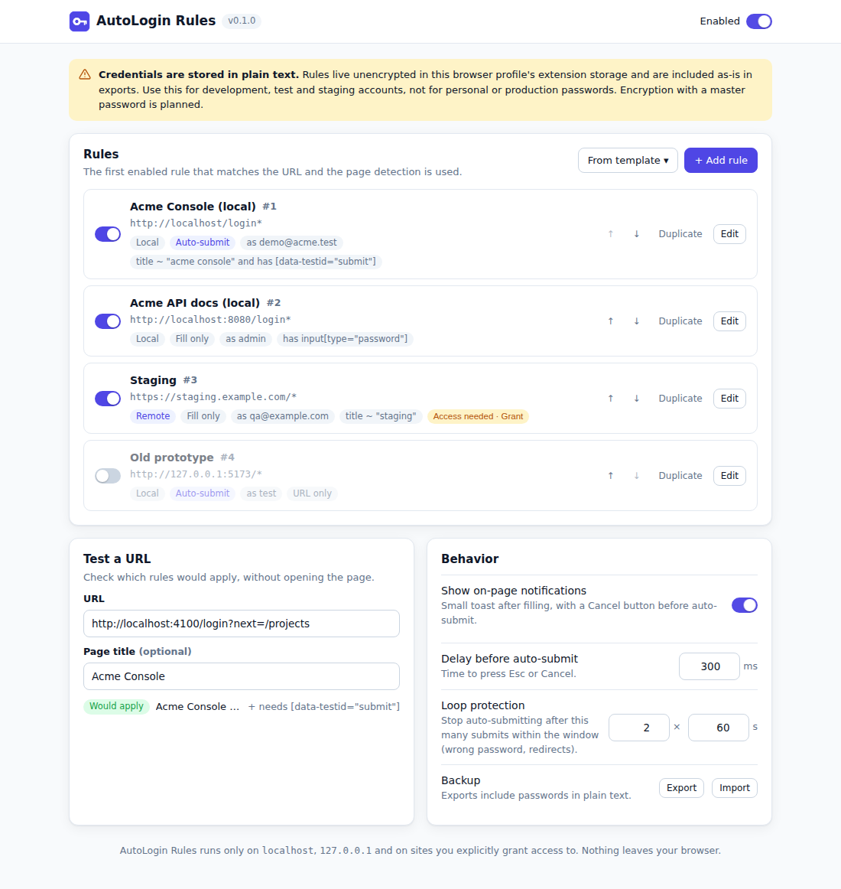
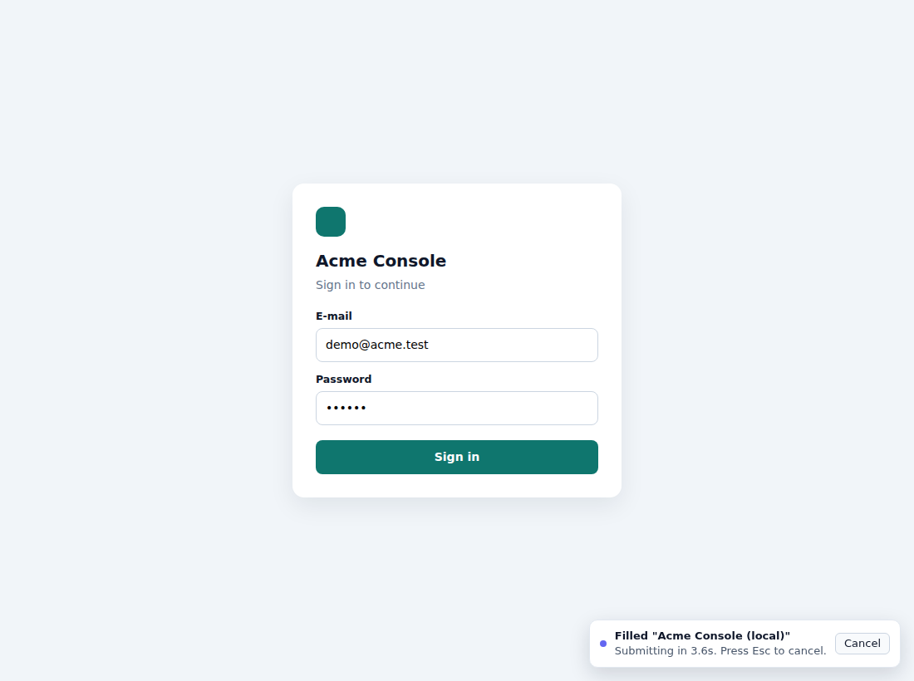
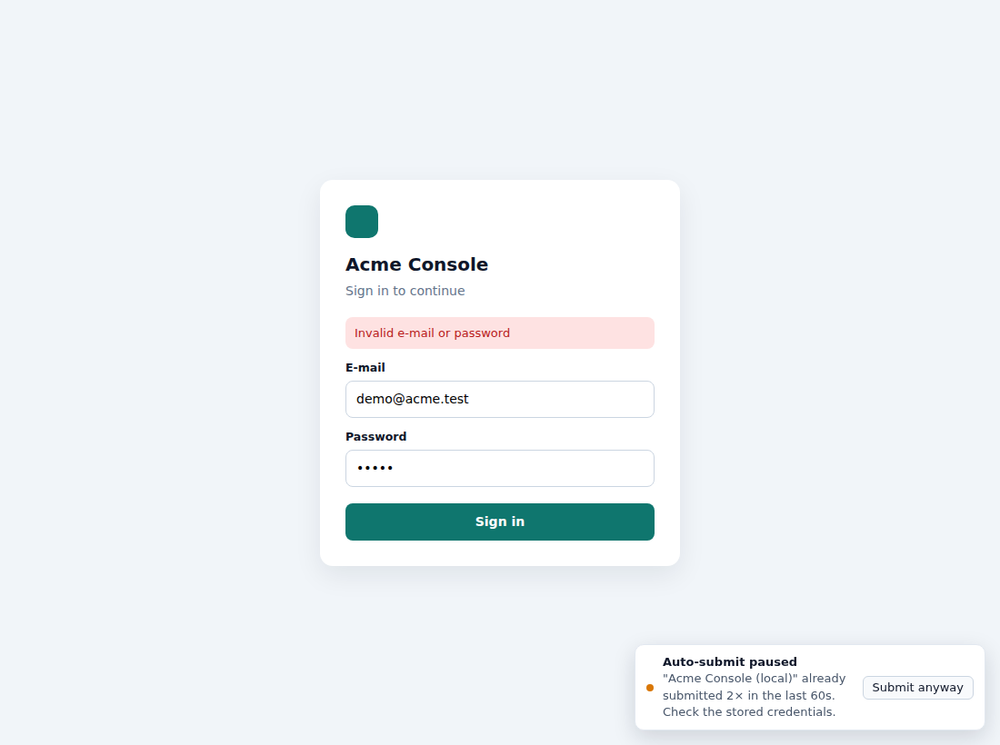
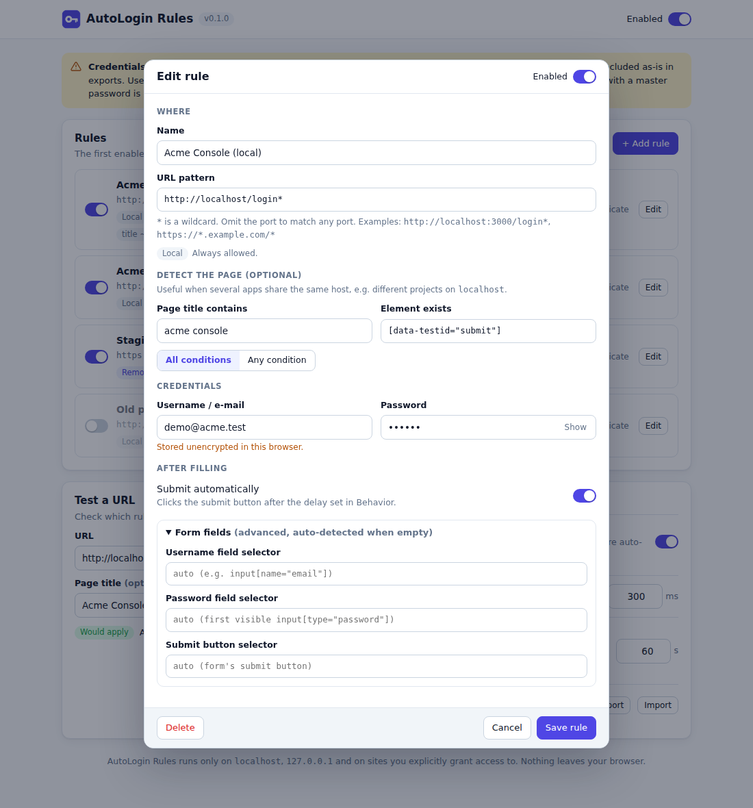
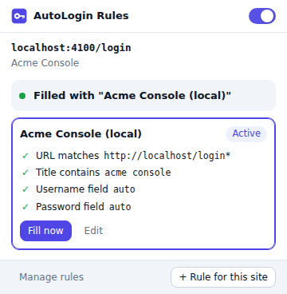
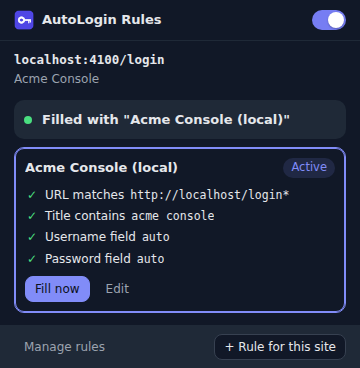
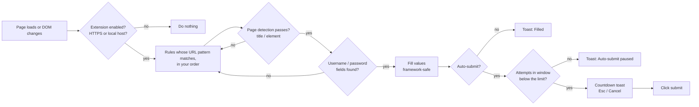

<p align="center">
  
</p>

<h1 align="center">AutoLogin Rules</h1>

<p align="center">
  Fill in and submit login forms automatically, based on <b>your own rules</b>.<br />
  One extension for Chrome and Firefox. No accounts, no cloud, no tracking.
</p>

<p align="center">
  
</p>

---

## Why

When you work on a web app, you log in to it hundreds of times: after every backend restart, after clearing
storage, in a fresh profile, on a feature branch with a new database. Password managers handle this poorly:
they don't auto-submit, get confused by `localhost:3000` versus `localhost:8080`, and usually ask before
every fill.

AutoLogin Rules does one thing: **when a page matches a rule, fill in the credentials and (optionally) submit**.
You decide exactly when that happens: by URL, port, path, page title or an element on the page.

## Features

| | |
|---|---|
| **Rule-based** | Each rule has a URL pattern, optional page detection, credentials and a submit policy. The first matching rule wins, and you set the order. |
| **Page detection** | Tell apart apps that share a host: *"title contains `Acme`"*, *"element `[data-app=admin]` exists"*, or both. |
| **Works with SPAs** | Waits for late-rendered forms and client-side navigation. Values are set so that React, Vue, Angular, Formik and similar libraries register them. |
| **Auto-submit, safely** | Short countdown toast with **Cancel** or **Esc**. Waits for disabled submit buttons to become enabled. |
| **Loop protection** | Wrong stored password? Auto-submit stops after *N* attempts in *M* seconds, so you never hammer a login endpoint. |
| **Any site, minimal access** | `localhost` and `127.0.0.1` work out of the box. Every other site requires an explicit, per-origin permission that you grant when you save the rule. |
| **Popup diagnostics** | See which rule matched and why another one didn't (URL, title, element, fields found), and use **Fill now** on demand. |
| **Test a URL** | Check which rule would apply to a URL without opening it. |
| **Import / export** | Share a rule set with your team as JSON. |
| **Light and dark** | Follows the system theme. |

> [!WARNING]
> **Credentials are stored in plain text** in the extension's local storage (`storage.local`) and in exports.
> This is intended for development, test and staging accounts. Don't store personal or production passwords.
> Optional encryption with a master password is on the [roadmap](#roadmap). The extension says the same thing
> at the top of its settings page and next to the password field.

## Screenshots

<table>
  <tr>
    <td width="50%"><br /><sub>Form filled, submitting in a moment. Press Esc to cancel.</sub></td>
    <td width="50%"><br /><sub>Wrong password: loop protection stops after 2 attempts.</sub></td>
  </tr>
  <tr>
    <td><br /><sub>Rule editor with live validation.</sub></td>
    <td valign="top">
      <br /><sub>Popup: what matched on the current page.</sub><br /><br />
      <br /><sub>Dark mode.</sub>
    </td>
  </tr>
</table>

## Install

The extension is not in the stores yet. Build it once, then load it unpacked.

```bash
npm install          # only needed for tests; the build has no dependencies
npm run build        # -> dist/chrome, dist/firefox and matching .zip files
```

**Chrome, Edge, Brave, Arc** (version 110 or newer)

1. Open `chrome://extensions` and turn on **Developer mode**.
2. Click **Load unpacked** and select `dist/chrome`.
3. Pin the key icon to the toolbar. The settings page opens automatically.

**Firefox** (version 128 or newer)

1. Open `about:debugging#/runtime/this-firefox`.
2. Click **Load Temporary Add-on…** and select `dist/firefox/manifest.json`.

   Temporary add-ons are removed when Firefox restarts. To keep it installed, sign the zip as an unlisted add-on
   on [addons.mozilla.org](https://addons.mozilla.org/developers/) (free, automated), or use Firefox Developer Edition
   with `xpinstall.signatures.required = false`.
3. If the settings page shows *"Localhost access is not granted"*, click **Grant access**.

## Quick start

1. Open the settings page (toolbar icon → **Manage rules**).
2. Click **+ Add rule**, or open your login page and click **+ Rule for this site** in the popup, which pre-fills the URL.
3. Fill in the form:
   - **URL pattern**: `http://localhost:3000/login*`
   - **Page title contains**: the name of your app, if other apps also run on `localhost`
   - **Username** and **Password**
   - **Submit automatically**: on or off
4. Save, then reload the login page.

## How it works



- The **content script only runs on origins that an enabled rule targets and that you granted access to**.
  The background worker re-registers it whenever rules, settings or permissions change. On every other site
  the extension does nothing at all.
- Each form is filled **once per page**. If the login fails and the app re-renders the same form, the extension
  does not keep refilling it. A full reload counts as a new attempt and is subject to loop protection.
- The attempt counter lives in the tab's `sessionStorage`, so it is per tab and per origin, and it resets when the
  tab is closed.

## Rule reference

| Field | Required | Description |
|---|---|---|
| **Name** | yes | Shown in the list, the popup and the toast. |
| **Enabled** | | Disabled rules are kept but ignored. |
| **URL pattern** | yes | Where the rule applies. See [URL patterns](#url-patterns). |
| **Page title contains** | | Case-insensitive substring (`acme`), or a regex written as `/^Acme/i`. |
| **Element exists** | | Any CSS selector, e.g. `[data-app="admin"]`, `meta[name="app"][content="acme"]`. |
| **Match mode** | | `All conditions` (default) or `Any condition`. With no condition, the URL alone decides. |
| **Username / e-mail** | one of the two | Value typed into the username field. |
| **Password** | one of the two | Value typed into the password field. Stored in **plain text**. |
| **Submit automatically** | | Click the submit button after the delay set under *Behavior*. |
| **Username field selector** | | Leave empty to auto-detect (see below). |
| **Password field selector** | | Leave empty for the first visible `input[type=password]`. |
| **Submit button selector** | | Leave empty for the form's submit button. |

### URL patterns

```
<scheme>://<host>[:<port>]<path>
```

| Part | Values | Notes |
|---|---|---|
| scheme | `http`, `https`, `*` | `*` means http or https. Plain `http` is only allowed for local hosts. |
| host | `example.com`, `*.example.com`, `*`, `localhost`, `127.0.0.1` | `*.example.com` also matches `example.com`. |
| port | `3000`, `*`, or omitted | **Omitted means any port.** |
| path | glob, `*` matches anything | Matched against path and query string. Omitted means `/*`. |

| Pattern | Matches | Doesn't match |
|---|---|---|
| `http://localhost/*` | `http://localhost:3000/login`, `http://localhost:8080/` | `https://localhost/` |
| `http://localhost:3000/login*` | `http://localhost:3000/login?next=/projects` | `http://localhost:3001/login` |
| `*://127.0.0.1:8080/*` | `http://127.0.0.1:8080/x`, `https://127.0.0.1:8080/x` | `http://localhost:8080/x` |
| `https://*.example.com/*` | `https://example.com/`, `https://app.eu.example.com/a` | `https://badexample.com/` |

### Field auto-detection

When a selector is empty, the extension picks:

- **Password**: the first visible `input[type="password"]`.
- **Username**: among visible text, email and tel inputs in the same form, the first match in this order:
  1. an input with `autocomplete="username"` or `"email"`,
  2. an input whose `name` or `id` contains *user*, *email*, *login*, *account* or *name*,
  3. the last text input before the password field,
  4. the first text input.
- **Submit**: `button[type=submit]` or `input[type=submit]` in the form, then a `<button>` without a type. If there is
  none, the form is submitted with `requestSubmit()`. Without a form, the extension presses Enter in the password field.

Use explicit selectors when a page has several forms, or when auto-detection picks the wrong field.

## Behavior settings

| Setting | Default | |
|---|---|---|
| Enabled (top bar) | on | Master switch. Also in the popup. |
| Show on-page notifications | on | The toast in the bottom-right corner. It lives in a Shadow DOM, so it never inherits or breaks page styles. |
| Delay before auto-submit | 800 ms | Time you have to press **Esc** or **Cancel**. `0` submits immediately. |
| Loop protection | 2× in 60 s | After this many auto-submits in the window, the extension stops and shows **Submit anyway**. |

## Permissions and security

| Permission | Why |
|---|---|
| `storage` | Store rules and settings locally. |
| `scripting` | Register the content script only on origins your rules target. |
| `activeTab` | **Fill now** in the popup on a page the extension has no standing access to. |
| host `*://localhost/*`, `*://127.0.0.1/*` | Local development works without extra prompts. |
| optional host `*://*/*` | **Never requested as a whole.** When you save a rule for `https://staging.example.com/*`, the browser asks for exactly that origin. Deleting the last rule for an origin revokes the permission. |

Built-in safeguards:

- Credentials are **never filled over plain HTTP** on non-local hosts, even if a pattern allows it.
- A rule matching every host (`https://*/*`) triggers a warning in the editor.
- A remote rule with auto-submit triggers a warning about account lockouts.
- No network requests, analytics or remote code. Everything stays in `storage.local` of your browser profile.

What it does **not** protect against: anyone with access to your browser profile (or an export file) can read the
stored passwords. Treat the rules like a `.env` file.

## Recipes

<details>
<summary><b>Local app that shares <code>localhost</code> with other projects</b></summary>

Example with [Tolgee](https://github.com/tolgee/tolgee-platform) running locally:

| Field | Value |
|---|---|
| URL pattern | `http://localhost/login*` |
| Page title contains | `tolgee` |
| Element exists | `[data-cy="login-button"]` |
| Username field selector | `input[name="username"]` |
| Password field selector | `input[name="password"]` |
| Submit button selector | `[data-cy="login-button"]` |
| Submit automatically | on |

The title and element checks keep the rule from firing on another app's `/login` on a different port.
</details>

<details>
<summary><b>Two users on two ports</b> (e.g. an admin UI and a customer UI)</summary>

Create two rules: `http://localhost:3000/*` with `admin` and `http://localhost:3001/*` with `customer`.
Ports are part of the match, so each rule only fires on its own port.
</details>

<details>
<summary><b>Same app, different user per environment</b></summary>

`http://localhost/*` → `dev@example.test`, and `https://staging.example.com/*` → `qa@example.com` with auto-submit
off. The staging rule asks for access to `https://staging.example.com/*` when you save it.
</details>

<details>
<summary><b>Django admin, Keycloak, Grafana…</b></summary>

These have standard forms, so leave the selectors empty and add a title condition (`Django site admin`, `Keycloak`,
`Grafana`). For Keycloak, point the URL pattern at the realm login path, e.g.
`http://localhost:8180/realms/*/protocol/openid-connect/auth*`.
</details>

<details>
<summary><b>Temporarily switch accounts</b></summary>

Duplicate the rule, change the credentials, and use the toggles in the list (or the move buttons) to choose which one
is active. Only the first enabled matching rule is used.
</details>

## Troubleshooting

| Symptom | Fix |
|---|---|
| Nothing happens on a remote site | The rule shows **Access needed**. Click **Grant**, or open the popup and click **Grant access**. |
| Nothing happens right after adding a rule | Tabs opened before the rule existed need a reload. The popup offers **Reload tab**. |
| Wrong field gets filled | Set explicit selectors under *Form fields (advanced)*. |
| Values appear but the app says "required" | The app listens to an unusual event. Try explicit selectors; if that doesn't help, report the framework and version. |
| Popup says "Auto-submit paused" | The stored password is probably wrong. Fix it, or click **Submit anyway** in the toast. |
| Rule matches in "Test a URL" but not on the page | Check the popup: it shows which condition (title, element, field) failed on the live page. |
| Firefox: rules for localhost don't run | Settings page → **Grant access** (Firefox can decline host permissions at install). |

## Limitations

- Username and password must be on the **same page**. Multi-step logins (e-mail → Next → password) are not supported yet.
- Forms inside **iframes** are not filled.
- No **TOTP/2FA** support.
- **HTTP basic auth** dialogs are not handled. They are browser UI, not page forms.
- One set of credentials per rule. Use several rules to switch between accounts.

## Roadmap

- [ ] Optional encryption with a master password (WebCrypto AES-GCM with a PBKDF2 key, unlocked once per browser session)
- [ ] Multi-step logins (fill username → click Next → wait → fill password)
- [ ] Element picker to choose selectors by clicking the page
- [ ] Several accounts per rule, with a picker in the popup
- [ ] Keyboard shortcut for **Fill now**
- [ ] TOTP codes from a stored secret (dev and test only)
- [ ] Iframe support
- [ ] Chrome Web Store and addons.mozilla.org listings

## Development

```
src/
  manifest.json      generated per browser by scripts/build.mjs
  background.js      registers the content script on granted origins, badge
  content/content.js detection, fill, submit, toast, loop protection
  lib/core.js        pure logic shared by all contexts (patterns, validation, storage)
  options/           settings page (rules, editor, test a URL, behavior, import/export)
  popup/             per-tab diagnostics and "Fill now"
  shared/ui.css      design tokens (light and dark)
scripts/build.mjs    builds dist/chrome and dist/firefox (+ zips), no dependencies
test/core.test.mjs   unit tests (node:test)
test/e2e.mjs         Playwright: loads the extension into Chromium and runs it against the demo apps
test/demo-server.mjs two small React login apps on :4100 and :4200
```

```bash
npm test                               # unit tests
npm run build && npm run test:e2e      # end-to-end in Chromium
node test/e2e.mjs --screenshots        # also regenerates docs/*.png
node test/demo-server.mjs              # demo apps for manual testing (demo@acme.test / secret)
npx web-ext lint -s dist/firefox       # Firefox add-on linter
```

No framework and no bundler: plain JavaScript, loaded as classic scripts so that one `lib/core.js` works in the
Chrome service worker, the Firefox event page, content scripts and extension pages. The only difference between the
two builds is the `background` key in the manifest (service worker vs. scripts) and Firefox's
`browser_specific_settings`.

### Storage schema

```jsonc
// storage.local["autologin"]
{
  "schemaVersion": 1,
  "settings": { "enabled": true, "showToast": true, "submitDelayMs": 800, "maxAttempts": 2, "attemptWindowSec": 60 },
  "rules": [
    {
      "id": "3f1c…",
      "name": "My app (local)",
      "enabled": true,
      "urlPattern": "http://localhost:3000/login*",
      "detect": { "title": "my app", "selector": "", "mode": "all" },
      "username": "admin",
      "password": "admin",           // plain text
      "usernameSelector": "",
      "passwordSelector": "",
      "submitSelector": "",
      "autoSubmit": true,
      "createdAt": 1758620000000,
      "updatedAt": 1758620000000
    }
  ]
}
```

## License

MIT
